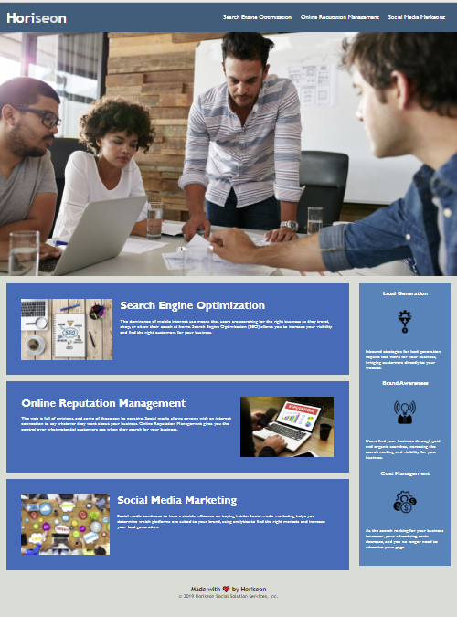

# Module 1 Challenge - Homework1

## Table of contents

- [Overview](#overview)
  - [The challenge](#the-challenge)
  - [User Story](#user-story)
  - [Acceptance Criteria](#acceptance-criteria)
  - [Screenshot](#screenshot)
  - [Links](#links)
- [My process](#my-process)
  - [Built with](#built-with)
  - [What I learned](#what-i-learned)
  - [Useful resources](#useful-resources)

## Overview

Web accessibility is an increasingly important consideration for businesses. It ensures that people with disabilities can access a website using assistive technologies such as video captions, screen readers, and braille keyboards. Making a website accessible is also good for business for many reasons, one of them being that accessible sites are better positioned in search engines like Google. It also helps companies avoid litigation that can occur when people with disabilities can't access their website.

To impress clients, you should always go the extra mile and improve the codebase for long-term sustainability. For example, make sure that all links are functioning correctly. Also, rework the CSS to make it more efficient by consolidating CSS selectors and properties, organizing them to follow the semantic structure of the HTML elements, and including comments before each element or section of the page.

### The challenge

One of the most common tasks for front-end and junior developers is to take existing code and refactor it (recall that to refactor code is to improve it without changing what it does) to meet a certain set of standards or implement a new technology. In this Challenge, a marketing agency has hired you to refactor an existing site to make it more accessible.

### User Story

```
AS A marketing agency
I WANT a codebase that follows accessibility standards
SO THAT our own site is optimized for search engines
```

### Acceptance Criteria

```
GIVEN a webpage meets accessibility standards
WHEN I view the source code
THEN I find semantic HTML elements
WHEN I view the structure of the HTML elements
THEN I find that the elements follow a logical structure independent of styling and positioning
WHEN I view the image elements
THEN I find accessible alt attributes
WHEN I view the heading attributes
THEN they fall in sequential order
WHEN I view the title element
THEN I find a concise, descriptive title
```

### Screenshot



### Links

- Github Repository URL: [Github Repository](https://github.com/rmdn321/homework-1)
- Github Pages URL: [Github Pages](https://rmdn321.github.io/homework-1/)

## My process

### Built with

- Semantic HTML5 markup
- CSS

### What I learned

- Learnt how to use semantic HTML tags to increase the accessibility of the webpage.
- Learnt how to consolidate and organize CSS selectors. 

### Useful resources

- [Alt Text](https://accessibility.huit.harvard.edu/describe-content-images) - Referred to this article on how to write good alt text to describe images.
